# Group Xpense - Smart Group Expense Manager

A beautiful and intuitive Flutter application for managing group expenses with multi-payer support, biometric security, multi-currency capabilities, and comprehensive backup/restore functionality.


##  App

[](https://drive.google.com/drive/folders/1KI9WyuhOV_0zXjhrNkY_bw8CJbT_h2kc?usp=sharing)

## 🎨 Screenshots

<div align="center">
  
  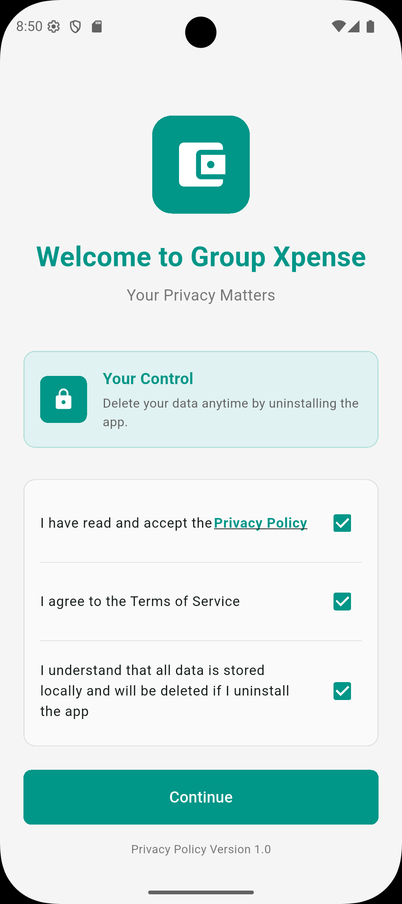
  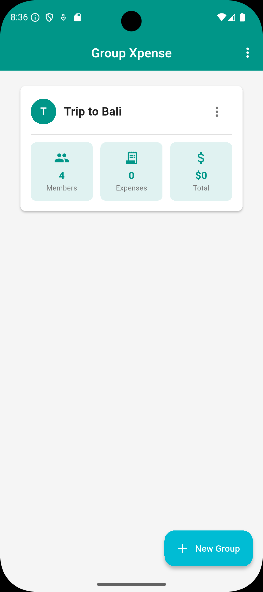
</div>

<div align="center">
  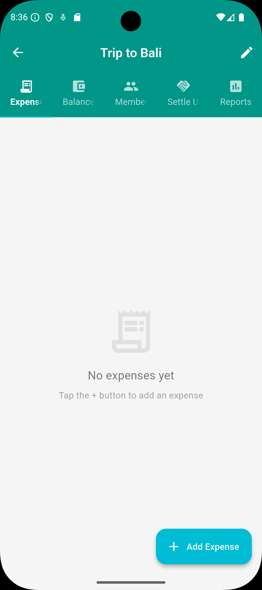
  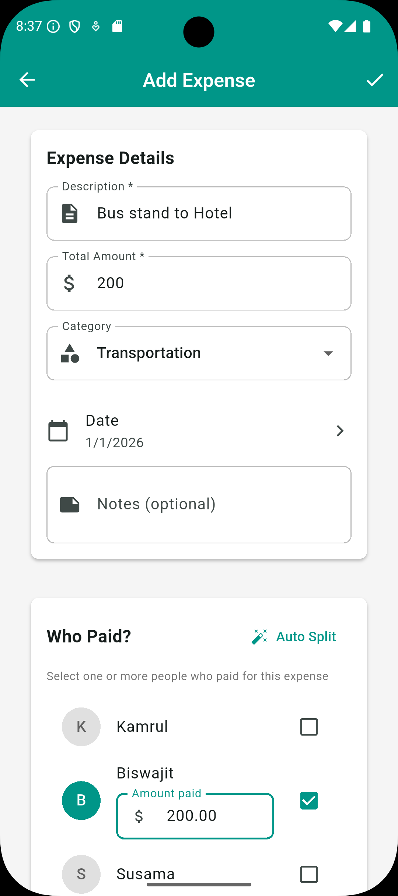
  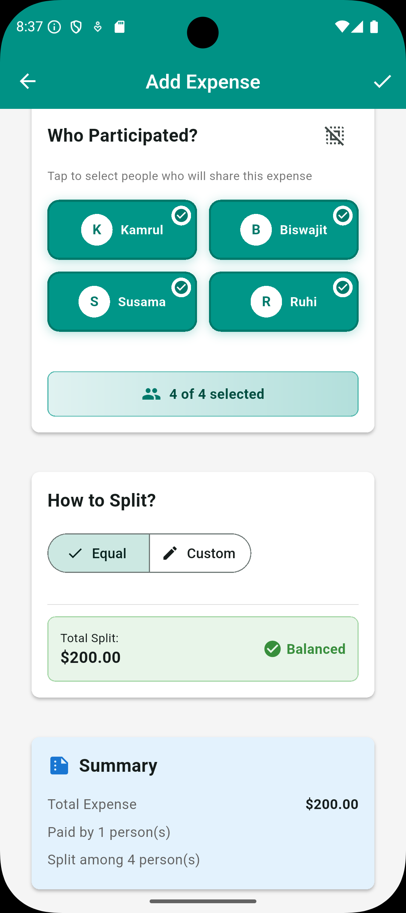
</div>

<div align="center">
  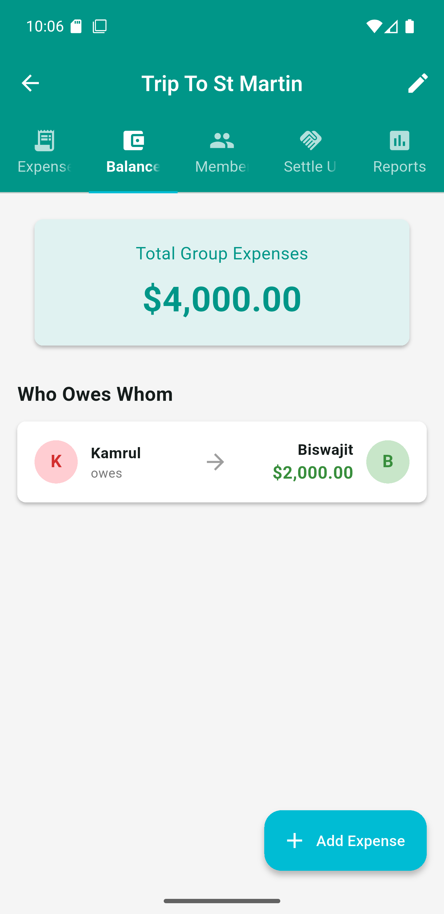
  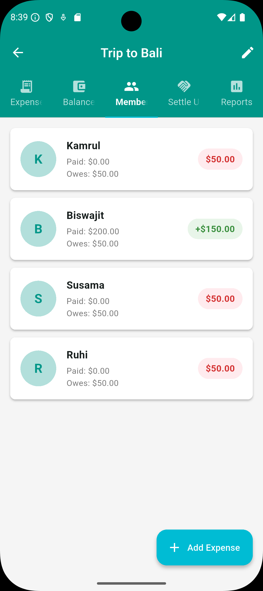
  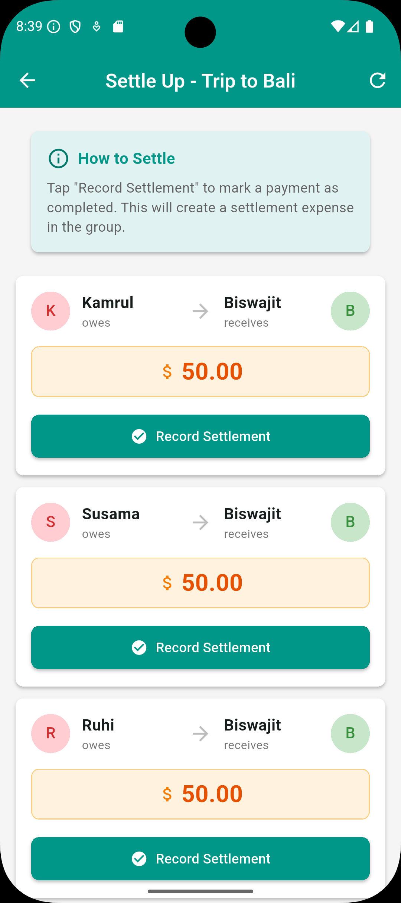
</div>

<div align="center">
  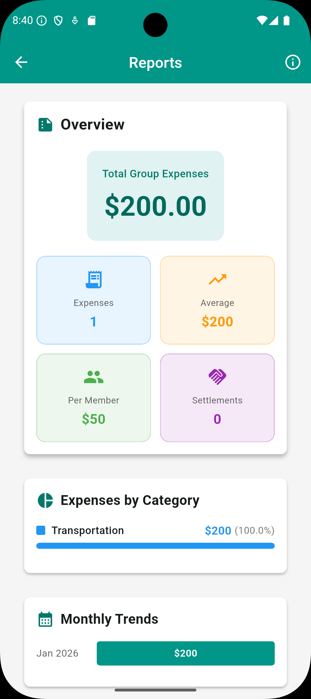
  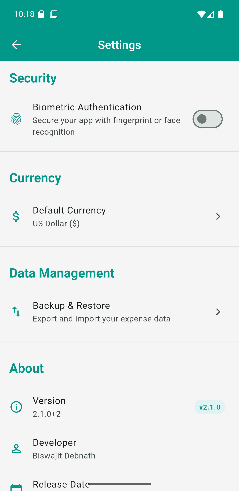
  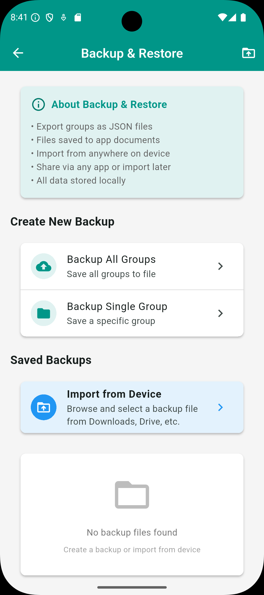
</div>

### Design Philosophy
- **Modern Material Design 3**: Clean, professional interface
- **Teal & Cyan Theme**: Professional color scheme (#009688 and #00BCD4)
- **High Contrast**: White text on colored backgrounds
- **Consistent UI**: Rectangular cards with 8px border radius throughout

## ✨ Core Features

### 💾 Data Management
- **SQLite Database**: Robust local storage with version migration
- **Automatic Sync**: Real-time updates across the app
- **Data Integrity**: Foreign key constraints with cascading deletes
- **Offline First**: No internet required - works completely offline
- **Import/Export**: JSON-based backup and restore functionality
- **Duplicate Detection**: Smart handling of existing data during import

### 🔐 Security & Privacy
- **Biometric Authentication**: Fingerprint/Face ID support on app launch
- **Local Storage Only**: Complete privacy - no cloud sync
- **Privacy Policy**: Built-in privacy consent screen
- **No Login Required**: No personal information collected
- **Device Security**: Protected by device lock screen

### 💱 Multi-Currency Support
- **15+ Currencies**: USD, EUR, GBP, JPY, AUD, CAD, CNY, INR, BDT, and more
- **Dynamic Display**: All amounts shown in selected currency
- **Per-User Settings**: Each user can choose their preferred currency
- **Real-time Updates**: Currency symbols update throughout the app

### 👥 Group Management
- ✅ Create unlimited expense groups
- ✅ Add/remove members dynamically
- ✅ Edit group details and members
- ✅ Delete groups with confirmation
- ✅ Quick actions via three-dot menu
- ✅ Pull-to-refresh for data updates

### 💰 Advanced Expense Tracking

#### Multi-Payer Support (NEW)
- **Multiple Payers**: Split payment among multiple people
- **Auto-Distribution**: Automatically divide amounts equally among payers
- **Custom Amounts**: Set specific payment amounts for each payer
- **Real-time Validation**: Ensures total paid equals total expense
- **Visual Indicators**: Clear balance summary with color-coded feedback

#### Expense Features
- ✅ Add/edit/delete expenses with detailed information
- ✅ Multiple payers per expense
- ✅ Category classification (Food, Transport, Entertainment, Shopping, Utilities, Rent, Other)
- ✅ Custom date tracking
- ✅ Notes and additional details
- ✅ Settlement tracking (mark payments as settlements)
- ✅ Expense detail view with full information

### 🔀 Smart Splitting
- **Equal Split**: Automatically divide amounts equally
- **Custom Split**: Set specific amounts for each participant
- **Multi-Payer Splitting**: Multiple people can pay different amounts
- **Participant Selection**: Visual cards for easy selection
- **Real-time Calculation**: See splits as you type
- **Automatic Validation**: Ensures splits equal total amount
- **Balance Indicators**: Visual feedback for payment balance

### 📊 Comprehensive Reporting
- **Category Reports**: Detailed breakdown by category with percentages
- **Monthly Reports**: Spending trends over time
- **Summary Statistics**:
  - Total expenses
  - Number of expenses
  - Average per expense
  - Per member breakdown
- **Visual Charts**: Progress bars for category distribution
- **Export Capabilities**: Share reports and data

### 💳 Balance & Settlement
- **Who Owes Whom**: Automatic calculation of settlements
- **Minimized Transactions**: Optimized payment suggestions
- **Net Balances**: Clear view of who's ahead and who owes
- **Member Statistics**: Individual paid/owed amounts
- **Settlement Recording**: Track payments with settlement expenses
- **Balance Validation**: Ensure all payments balance correctly

### 📤 Backup & Restore (NEW)

#### Export Features
- **Single Group Export**: Export individual groups as JSON
- **Complete Backup**: Export all groups at once
- **Local Storage**: Files saved to app documents directory
- **Share Options**: Share via any app (Email, Drive, Messaging, etc.)
- **Timestamped Files**: Automatic naming with timestamps

#### Import Features
- **Browse Device**: File picker to select from anywhere on device
- **Import from Downloads**: Access files from Downloads, Google Drive, etc.
- **File Preview**: See backup details before importing
- **Duplicate Handling**: Smart detection and skipping of existing groups
- **Import Validation**: Checks file format and version compatibility
- **Save to App**: Option to save external files to app storage

#### Backup Management
- **View All Backups**: List of saved backup files with dates and sizes
- **Quick Restore**: Tap any file to restore
- **File Actions**: Share, restore, or delete backups
- **File Information**: Shows creation date, size, and content summary

### 🎯 User Experience
- **Pull to Refresh**: Swipe down to refresh on all screens
- **Tap to View**: Tap expenses for full details
- **Quick Edit**: Edit button in expense details
- **Confirmation Dialogs**: Prevents accidental deletions
- **Success Messages**: Clear feedback for all actions
- **Loading Indicators**: Smooth async operation handling
- **Three-dot Menus**: Consistent actions across screens
- **Visual Participant Selection**: Card-based UI for better visibility

## 📦 Installation

### Prerequisites
- Flutter SDK 3.10.4 or higher
- Dart SDK 3.10.4 or higher
- Android Studio / VS Code / Xcode
- Android SDK (for Android) or Xcode (for iOS)

### Steps
```bash
# 1. Clone the repository
git clone https://github.com/coderbdsust/group-xpense.git

# 2. Navigate to project directory
cd group_xpense

# 3. Install dependencies
flutter pub get

# 4. Run the app
flutter run            # For Android/iOS
flutter run -d chrome  # For web (limited features)
```

## 🗂️ Project Structure
```
group_xpense/
├── lib/
│   ├── main.dart                           # App entry + Theme + Providers
│   ├── models/
│   │   ├── person.dart                     # Person/Member model
│   │   ├── group.dart                      # Group model
│   │   ├── expense.dart                    # Expense model with multi-payer
│   │   └── app_settings.dart               # App settings model
│   ├── services/
│   │   ├── database_helper.dart            # SQLite database service
│   │   ├── biometric_service.dart          # Biometric authentication
│   │   ├── currency_service.dart           # Currency management
│   │   └── export_import_service.dart      # Backup/restore functionality
│   ├── providers/
│   │   ├── expense_provider.dart           # Expense state management
│   │   └── settings_provider.dart          # Settings state management
│   ├── screens/
│   │   ├── home_screen.dart                # Groups list with refresh
│   │   ├── biometric_lock_screen.dart      # Biometric authentication screen
│   │   ├── privacy_consent_screen.dart     # Privacy policy consent
│   │   ├── create_group_screen.dart        # Create new group
│   │   ├── edit_group_screen.dart          # Edit group & manage members
│   │   ├── group_detail_screen.dart        # Expenses/Balances/Members tabs
│   │   ├── add_expense_multi_payer_screen.dart  # Multi-payer expense form
│   │   ├── expense_detail_screen.dart      # View/Edit/Delete expense
│   │   ├── reports_screen.dart             # Category & monthly reports
│   │   ├── settle_up_screen.dart           # Record settlements
│   │   ├── settings_screen.dart            # App settings
│   │   └── export_import_screen.dart       # Backup & restore management
│   ├── widgets/
│   │   └── currency_text.dart              # Dynamic currency display widget
│   └── utils/
│       ├── app_constants.dart              # App version and constants
│       └── privacy_policy.dart             # Privacy policy content
├── screenshots/                             # App screenshots
└── pubspec.yaml                            # Dependencies and metadata
```

## 💾 Database Schema

### Tables

**groups**
```sql
CREATE TABLE groups (
  id TEXT PRIMARY KEY,
  name TEXT NOT NULL,
  description TEXT,
  createdAt TEXT NOT NULL
);
```

**persons**
```sql
CREATE TABLE persons (
  id TEXT PRIMARY KEY,
  name TEXT NOT NULL,
  email TEXT,
  avatar TEXT,
  groupId TEXT NOT NULL,
  FOREIGN KEY (groupId) REFERENCES groups (id) ON DELETE CASCADE
);
```

**expenses**
```sql
CREATE TABLE expenses (
  id TEXT PRIMARY KEY,
  groupId TEXT NOT NULL,
  description TEXT NOT NULL,
  amount REAL NOT NULL,
  paidById TEXT NOT NULL,
  date TEXT NOT NULL,
  category TEXT,
  notes TEXT,
  isSettlement INTEGER DEFAULT 0,
  FOREIGN KEY (groupId) REFERENCES groups (id) ON DELETE CASCADE
);
```

**expense_payers** (Multi-Payer Support)
```sql
CREATE TABLE expense_payers (
  expenseId TEXT NOT NULL,
  personId TEXT NOT NULL,
  amount REAL NOT NULL,
  PRIMARY KEY (expenseId, personId),
  FOREIGN KEY (expenseId) REFERENCES expenses (id) ON DELETE CASCADE,
  FOREIGN KEY (personId) REFERENCES persons (id) ON DELETE CASCADE
);
```

**expense_participants** (Many-to-Many)
```sql
CREATE TABLE expense_participants (
  expenseId TEXT NOT NULL,
  personId TEXT NOT NULL,
  PRIMARY KEY (expenseId, personId),
  FOREIGN KEY (expenseId) REFERENCES expenses (id) ON DELETE CASCADE,
  FOREIGN KEY (personId) REFERENCES persons (id) ON DELETE CASCADE
);
```

**expense_splits**
```sql
CREATE TABLE expense_splits (
  expenseId TEXT NOT NULL,
  personId TEXT NOT NULL,
  amount REAL NOT NULL,
  PRIMARY KEY (expenseId, personId),
  FOREIGN KEY (expenseId) REFERENCES expenses (id) ON DELETE CASCADE,
  FOREIGN KEY (personId) REFERENCES persons (id) ON DELETE CASCADE
);
```

## 📱 How to Use

### First Time Setup
1. **Accept Privacy Policy**: Read and accept on first launch
2. **Set Up Biometrics** (Optional): Enable fingerprint/face authentication
3. **Choose Currency**: Select your preferred currency in settings

### Creating a Group
1. Tap the **"New Group"** FAB on home screen
2. Enter group name (e.g., "Weekend Trip")
3. Add description (optional)
4. Add members one by one
5. Tap **"Create Group"**

### Managing Groups
**Edit Group:**
- Tap three-dot menu → "Edit Group"
- Modify name, description, or members
- Add new members or remove existing ones

**Delete Group:**
- Tap three-dot menu → "Delete Group"
- Confirm deletion (all expenses will be deleted)

**Refresh Groups:**
- Pull down on groups list to refresh
- Or tap refresh icon in three-dot menu

### Adding Multi-Payer Expenses
1. Open a group
2. Tap **"Add Expense"** FAB
3. Enter description and total amount
4. **Select Payers**:
   - Check one or more people who paid
   - Enter amount each person paid
   - Use "Auto Split" for equal division
5. **Select Participants**:
   - Choose who will share the expense
   - Visual cards show selection clearly
6. **Choose Split Type**:
   - **Equal**: Divided equally among participants
   - **Custom**: Set specific amounts
7. Review summary and tap **"Add Expense"**

### Recording Settlements
1. Open a group → Navigate to "Balances" tab
2. Tap on a settlement suggestion or use "Settle Up" option
3. Enter payment details
4. Mark as settlement
5. Settlement appears in expense list with special badge

### Viewing Reports
1. Open a group
2. Tap three-dot menu → "Reports"
3. View:
   - Category breakdown with charts
   - Monthly spending trends
   - Detailed statistics

### Backup & Restore

#### Creating Backups
1. Go to Settings → "Backup & Restore"
2. Choose:
   - **Backup All Groups**: Complete backup
   - **Backup Single Group**: Export specific group
3. File saved to app documents automatically
4. Option to share via any app

#### Restoring from Backup
1. Go to Settings → "Backup & Restore"
2. Choose:
   - **Browse**: Select file from device
   - **Restore**: Pick from saved backups
3. Preview backup details before importing
4. Confirm import (duplicates are skipped)
5. Groups refresh automatically

#### Managing Backups
- **View Saved Backups**: See all backup files with dates
- **Share Backups**: Send via email, Drive, messaging
- **Delete Old Backups**: Clean up unused files
- **Import External Files**: Browse Downloads, Drive, etc.

### Changing Settings
1. Tap three-dot menu on home screen → "Settings"
2. Customize:
   - **Currency**: Choose from 15+ currencies
   - **Biometric Lock**: Enable/disable fingerprint/face ID
   - **Privacy Policy**: Review privacy terms
   - **Backup & Restore**: Manage backups
   - **App Version**: Check current version

## 🎨 Theme & Design

### Color Scheme
```dart
Primary: Colors.teal (#009688)
Secondary: Colors.cyan (#00BCD4)
Background: Colors.grey[100] (#F5F5F5)
Card Background: Colors.white
Text on Teal/Cyan: Colors.white
Success: Colors.green
Warning: Colors.orange
Error: Colors.red
Border Radius: 8px (consistent rectangular cards)
```

### Material Design 3 Features
- ✅ Color system with seed color
- ✅ Typography scale (M3)
- ✅ Elevation system (0dp, 1dp, 2dp, 4dp)
- ✅ Shape system (8px rounded corners)
- ✅ Motion and interaction patterns
- ✅ Accessibility standards (WCAG AA)
- ✅ Dark theme ready (can be enabled)

## 🔧 Dependencies
```yaml
dependencies:
  flutter:
    sdk: flutter
  cupertino_icons: ^1.0.8
  provider: ^6.1.2              # State management
  intl: ^0.20.0                 # Date/currency formatting
  uuid: ^4.5.1                  # Unique ID generation
  shared_preferences: ^2.3.3    # Settings persistence
  sqflite: ^2.3.3+2             # SQLite database
  path: ^1.9.0                  # Path manipulation
  local_auth: ^2.2.0            # Biometric authentication
  flutter_markdown: ^0.6.18     # Privacy policy rendering
  path_provider: ^2.1.2         # File system access
  share_plus: ^8.0.2            # Share functionality
  file_picker: ^8.0.0+1         # File selection

dev_dependencies:
  flutter_test:
    sdk: flutter
  flutter_lints: ^6.0.0         # Code analysis
```

## 📊 Key Algorithms

### Multi-Payer Balance Settlement
```dart
1. Calculate individual balances:
   - For each person:
     * Total Paid = Sum of all payer amounts
     * Total Owed = Sum of split amounts
     * Net Balance = Total Paid - Total Owed

2. Separate creditors and debtors:
   - Creditors: Net Balance > 0 (owed money)
   - Debtors: Net Balance < 0 (owes money)

3. Minimize transactions:
   - Match largest debtor with largest creditor
   - Continue until all balanced
   - Generate settlement suggestions

4. Settlement validation:
   - Ensure total paid = total expense
   - Verify splits sum to total
   - Check balance accuracy
```

### Split Calculation with Multi-Payer
```dart
Equal Split:
- Amount per person = Total Amount / Number of Participants

Custom Split:
- Each participant has specific amount
- Validation: Sum of splits = Total amount

Multi-Payer:
- Each payer specifies amount paid
- Validation: Sum of payer amounts = Total amount
- Auto-distribute: Divide equally among selected payers
```

### Import/Export Algorithm
```dart
Export:
1. Serialize group data to JSON
2. Include version and timestamp
3. Save to local file system
4. Provide share options

Import:
1. Validate JSON format and version
2. Check for duplicate group IDs
3. Preview backup contents
4. Insert if not exists (skip duplicates)
5. Refresh UI with new data
```

## 🚀 Performance Optimizations

1. **Database Indexing**: Fast queries on groupId and date
2. **In-Memory Caching**: Expense lists cached in provider
3. **Lazy Loading**: FutureBuilder loads data on demand
4. **Provider Pattern**: Efficient state management
5. **Pull-to-Refresh**: Manual refresh control
6. **Batch Operations**: Efficient multi-record operations
7. **Transaction Wrapping**: Atomic database operations
8. **Conflict Resolution**: Smart duplicate handling

## 🔐 Security & Privacy

### Security Features
- ✅ **Biometric Authentication**: Fingerprint/Face ID on launch
- ✅ **Local Storage**: All data on device
- ✅ **No Cloud Sync**: Complete privacy
- ✅ **No Analytics**: No tracking or data collection
- ✅ **Device Security**: Protected by OS security

### Privacy Compliance
- ✅ **Privacy Policy**: Clear, accessible privacy terms
- ✅ **Consent Screen**: Required on first launch
- ✅ **No PII Collection**: No personal information gathered
- ✅ **Data Control**: User owns all data
- ✅ **Export/Delete**: Full data portability

### Limitations
- ⚠️ **No Encryption**: Data in plain SQLite (consider sqlcipher for encryption)
- ⚠️ **No Backup Encryption**: JSON backups are unencrypted
- ⚠️ **Local Only**: No sync across devices

## 🐛 Troubleshooting

### Biometric Authentication Issues
**Problem**: Biometric prompt not showing  
**Solution**: Ensure device has biometrics enabled and app has permission

### Import/Export Issues
**Problem**: Backup file not importing  
**Solution**: Check file version matches app version (2.1.0)

**Problem**: Duplicate groups after import  
**Solution**: App automatically skips duplicates - this is expected behavior

### Database Issues
**Problem**: UNIQUE constraint failed  
**Solution**: Fixed in v2.1.0 - update to latest version

**Problem**: Expenses not showing  
**Solution**: Pull to refresh or restart app

### Currency Display Issues
**Problem**: Currency not updating  
**Solution**: Change currency in settings and restart app

## 📈 Roadmap & Future Enhancements

### Planned Features
- [ ] Cloud backup and sync (optional)
- [ ] Export to PDF/Excel
- [ ] Receipt photo attachments
- [ ] Dark mode theme
- [ ] Recurring expenses
- [ ] Budget limits and alerts
- [ ] QR code sharing
- [ ] Advanced charts and graphs
- [ ] Multiple group templates
- [ ] Expense categories customization
- [ ] Backup encryption
- [ ] Multi-language support

### Under Consideration
- [ ] Web dashboard
- [ ] Real-time collaboration
- [ ] Integration with payment apps
- [ ] AI-powered expense categorization
- [ ] Tax reporting features

## 🏗️ Build for Production

### Android APK
```bash
flutter build apk --release
# Output: build/app/outputs/flutter-apk/app-release.apk
```

### Android App Bundle (Play Store)
```bash
flutter build appbundle --release
# Output: build/app/outputs/bundle/release/app-release.aab
```

### iOS
```bash
flutter build ios --release
# Then archive in Xcode for App Store
```

## 📚 Code Examples

### Adding a Multi-Payer Expense
```dart
final expense = Expense(
  id: const Uuid().v4(),
  groupId: group.id,
  description: 'Dinner at restaurant',
  amount: 300.0,
  payers: [
    PayerShare(person: alice, amount: 150.0),
    PayerShare(person: bob, amount: 150.0),
  ],
  participants: [alice, bob, charlie],
  splits: {
    'alice-id': 100.0,
    'bob-id': 100.0,
    'charlie-id': 100.0,
  },
  date: DateTime.now(),
  category: 'Food & Drinks',
  notes: 'Italian restaurant',
);

await provider.addExpense(expense);
```

### Exporting a Backup
```dart
// Export single group
final file = await ExportImportService.exportGroupToFile(
  groupId,
  groupName,
);

// Export all groups
final file = await ExportImportService.exportAllGroupsToFile();

// Share the backup
await ExportImportService.shareAllGroupsFile();
```

### Importing from Backup
```dart
// Pick file from device
final file = await ExportImportService.pickFileFromDevice();

// Import the file
final result = await ExportImportService.importFromFilePath(
  file.path,
);

// Refresh UI
await provider.refreshGroups();
```

## 🤝 Contributing

Contributions are welcome! Please follow these steps:

1. Fork the repository
2. Create a feature branch (`git checkout -b feature/AmazingFeature`)
3. Commit your changes (`git commit -m 'Add some AmazingFeature'`)
4. Push to the branch (`git push origin feature/AmazingFeature`)
5. Open a Pull Request

### Contribution Guidelines
- Follow Dart style guide
- Add tests for new features
- Update documentation
- Ensure all tests pass
- Follow Material Design 3 principles

## 📄 License

This project is licensed under the MIT License - see the [LICENSE](LICENSE) file for details.

## 👨‍💻 Author

**Biswajit Debnath**
- GitHub: [@coderbdsust](https://github.com/coderbdsust)
- Email: biswajit.sust@gmail.com
- LinkedIn: [Biswajit Debnath](https://linkedin.com/in/biswajit-debnath)

## 🙏 Acknowledgments

- Flutter team for the amazing framework
- Material Design for comprehensive design guidelines
- SQLite for reliable local storage
- Provider package for elegant state management
- local_auth package for biometric authentication
- All open-source contributors and testers

## 📞 Support

- **Email**: biswajit.sust@gmail.com
- **Issues**: [GitHub Issues](https://github.com/coderbdsust/group-xpense/issues)
- **Discussions**: [GitHub Discussions](https://github.com/coderbdsust/group-xpense/discussions)

## ⭐ Show Your Support

Give a ⭐️ if this project helped you manage your group expenses better!

## 📊 Statistics

- **Version**: 2.1.0
- **Build**: 2
- **Release Date**: January 2025
- **Last Updated**: January 4, 2026
- **Status**: ✅ Production Ready
- **Platforms**: Android, iOS
- **Language**: Dart/Flutter
- **Lines of Code**: 5000+
- **Database Version**: 2
- **Supported Currencies**: 15+

---

*For questions, suggestions, or support, please open an issue or reach out via email.*