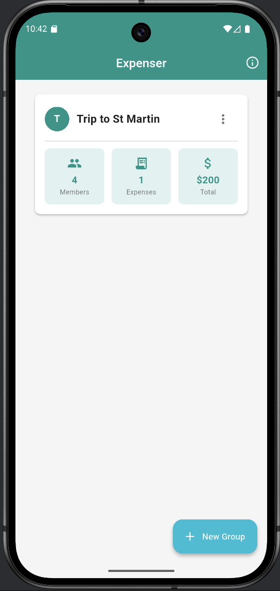
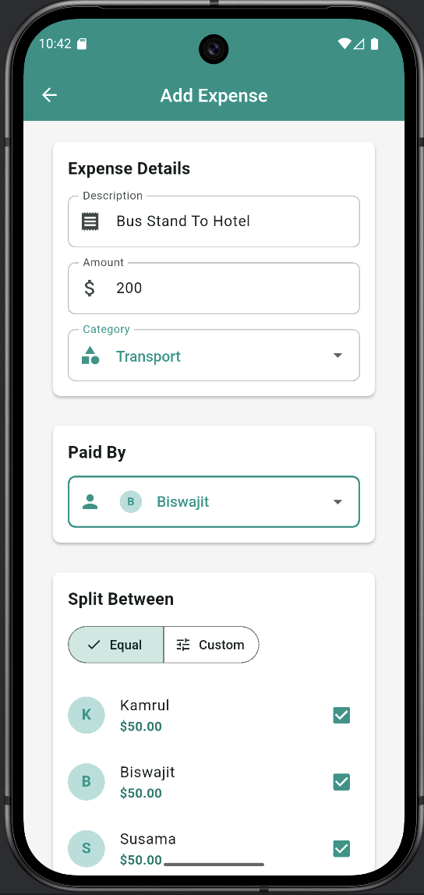
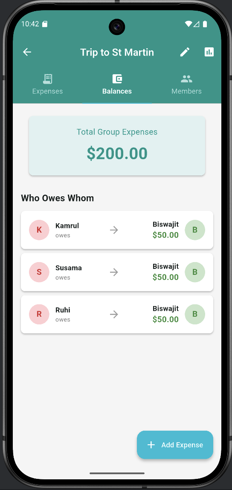

# Expenser - Group Expense Manager

A beautiful and intuitive Flutter application for managing group expenses with smart splitting capabilities, persistent storage, and comprehensive reporting.


## 🎨 Screenshots
 
 
 

### Teal & Cyan Theme
- Modern Material Design 3
- Professional teal (#009688) and cyan (#00BCD4) color scheme
- White text on colored backgrounds for high contrast
- Rectangular cards (8px border radius)

## ✨ Features

### 💾 Data Persistence
- **SQLite Database**: All data stored locally with SQLite
- **Automatic Sync**: Changes reflect immediately across the app
- **Data Integrity**: Foreign key constraints with cascading deletes
- **Offline First**: Works completely offline, no internet required

### 👥 Group Management
- ✅ Create unlimited expense groups
- ✅ Add/remove members dynamically
- ✅ Edit group name and description
- ✅ Delete groups (with confirmation)
- ✅ Long-press or menu options for quick actions

### 💰 Expense Tracking
- ✅ Add expenses with detailed information
- ✅ Edit existing expenses
- ✅ Delete expenses (with confirmation)
- ✅ View expense details
- ✅ Category classification (Food, Transport, Entertainment, Shopping, Accommodation, Other)
- ✅ Custom date tracking

### 🔀 Smart Splitting
- **Equal Split**: Automatically divide amounts equally
- **Custom Split**: Set specific amounts for each participant
- **Real-time Calculation**: See split amounts as you type
- **Validation**: Ensures splits equal total amount
- **Participant Selection**: Choose who participated in each expense

### 📊 Advanced Reporting
- **Category Reports**: Expenses breakdown by category with percentages
- **Monthly Reports**: View spending trends over time
- **Summary Statistics**:
    - Total expenses
    - Number of expenses
    - Average per expense
    - Per member breakdown
- **Visual Progress Bars**: Easy-to-read category distribution

### 💳 Balance Calculations
- **Who Owes Whom**: Automatic calculation of settlements
- **Minimized Transactions**: Optimized payment suggestions
- **Net Balances**: See who's ahead and who owes
- **Member Statistics**: Individual paid/owed amounts

### 🎯 User Experience
- **Pull to Refresh**: Swipe down to refresh expense lists
- **Tap to View**: Tap any expense to see full details
- **Edit on the Fly**: Quick edit button in expense details
- **Confirmation Dialogs**: Prevents accidental deletions
- **Success Messages**: Clear feedback for all actions
- **Loading Indicators**: Smooth async operation handling

## 📦 Installation

### Prerequisites
- Flutter SDK 3.10.4 or higher
- Dart SDK 3.10.4 or higher
- Android Studio / VS Code
- Android SDK (for Android) or Xcode (for iOS)

### Steps
```bash
# 1. Clone the repository
git clone https://github.com/coderbdsust/expenser_app.git

# 2. Navigate to project directory
cd expenser

# 3. Install dependencies
flutter pub get

# 4. Run the app
flutter run -d chrome  # For web
flutter run            # For Android/iOS
```

## 🗂️ Project Structure
```
expenser_app/
├── lib/
│   ├── main.dart                       # App entry + Teal/Cyan theme
│   ├── models/
│   │   ├── person.dart                 # Person/Member model
│   │   ├── group.dart                  # Group model
│   │   └── expense.dart                # Expense model
│   ├── services/
│   │   └── database_helper.dart        # SQLite database service
│   ├── providers/
│   │   └── expense_provider.dart       # State management with Provider
│   └── screens/
│       ├── home_screen.dart            # Groups list with edit/delete
│       ├── create_group_screen.dart    # Create new group
│       ├── edit_group_screen.dart      # Edit group & manage members
│       ├── group_detail_screen.dart    # Expenses/Balances/Members tabs
│       ├── add_expense_screen.dart     # Add/Edit expense form
│       ├── expense_detail_screen.dart  # View/Edit/Delete expense
│       └── reports_screen.dart         # Category & monthly reports
└── pubspec.yaml                        # Dependencies
```

## 💾 Database Schema

### Tables

**groups**
```sql
CREATE TABLE groups (
  id TEXT PRIMARY KEY,
  name TEXT NOT NULL,
  description TEXT,
  createdAt TEXT NOT NULL
);
```

**persons**
```sql
CREATE TABLE persons (
  id TEXT PRIMARY KEY,
  name TEXT NOT NULL,
  email TEXT,
  avatar TEXT,
  groupId TEXT NOT NULL,
  FOREIGN KEY (groupId) REFERENCES groups (id) ON DELETE CASCADE
);
```

**expenses**
```sql
CREATE TABLE expenses (
  id TEXT PRIMARY KEY,
  groupId TEXT NOT NULL,
  description TEXT NOT NULL,
  amount REAL NOT NULL,
  paidById TEXT NOT NULL,
  date TEXT NOT NULL,
  category TEXT,
  FOREIGN KEY (groupId) REFERENCES groups (id) ON DELETE CASCADE
);
```

**expense_participants** (Many-to-Many)
```sql
CREATE TABLE expense_participants (
  expenseId TEXT NOT NULL,
  personId TEXT NOT NULL,
  PRIMARY KEY (expenseId, personId),
  FOREIGN KEY (expenseId) REFERENCES expenses (id) ON DELETE CASCADE,
  FOREIGN KEY (personId) REFERENCES persons (id) ON DELETE CASCADE
);
```

**expense_splits**
```sql
CREATE TABLE expense_splits (
  expenseId TEXT NOT NULL,
  personId TEXT NOT NULL,
  amount REAL NOT NULL,
  PRIMARY KEY (expenseId, personId),
  FOREIGN KEY (expenseId) REFERENCES expenses (id) ON DELETE CASCADE,
  FOREIGN KEY (personId) REFERENCES persons (id) ON DELETE CASCADE
);
```

## 📱 How to Use

### Creating a Group
1. Tap the **"New Group"** FAB on home screen
2. Enter group name (e.g., "Weekend Trip")
3. Add description (optional)
4. Add members one by one
5. Tap **"Create Group"**

### Managing Groups
**Edit Group:**
- **Option 1**: Long-press on group card → Select "Edit Group"
- **Option 2**: Tap three-dot menu → Select "Edit Group"
- **Option 3**: Open group → Tap edit icon in AppBar

**Delete Group:**
- Long-press on group card → Select "Delete Group"
- Or tap three-dot menu → "Delete Group"
- Confirm deletion (all expenses will be deleted)

**Add Members to Existing Group:**
1. Edit the group
2. Enter member name in "Add Member" field
3. Tap "Add" button
4. Member appears in the list immediately

**Remove Members:**
1. Edit the group
2. Tap delete icon next to member name
3. Confirm removal

### Adding Expenses
1. Open a group
2. Tap **"Add Expense"** FAB
3. Enter description (e.g., "Dinner at restaurant")
4. Enter amount (e.g., 150.00)
5. Select category
6. Choose who paid
7. Select split type:
    - **Equal**: Divided equally among selected participants
    - **Custom**: Set specific amounts for each person
8. Select participants
9. Tap **"Add Expense"**

### Editing Expenses
1. Tap on any expense card
2. Tap edit icon in AppBar
3. Modify details
4. Tap **"Update Expense"**

### Deleting Expenses
1. Tap on expense card to view details
2. Tap delete icon in AppBar
3. Confirm deletion

### Viewing Reports
1. Open a group
2. Tap the **reports icon** (📊) in AppBar
3. View:
    - Category breakdown with percentages
    - Monthly spending trends
    - Summary statistics

### Checking Balances
1. Open a group
2. Navigate to **"Balances"** tab
3. View:
    - Total group expenses
    - Who owes whom
    - Suggested settlements

### Viewing Member Statistics
1. Open a group
2. Navigate to **"Members"** tab
3. See for each member:
    - Total paid
    - Total owed
    - Net balance (green = owed money, red = owes money)

## 🎨 Theme & Design

### Color Scheme
```dart
Primary: Colors.teal (#009688)
Secondary: Colors.cyan (#00BCD4)
Background: Colors.grey[100] (#F5F5F5)
Card Background: Colors.white
Text on Teal/Cyan: Colors.white
Border Radius: 8px (rectangular cards)
```

### Material Design 3 Compliance
- ✅ Color system with seed color
- ✅ Typography scale
- ✅ Elevation system (0dp, 1dp, 2dp, 4dp)
- ✅ Shape system (8px corners)
- ✅ Motion and interaction patterns
- ✅ Accessibility standards

## 🔧 Dependencies
```yaml
dependencies:
  flutter: sdk
  cupertino_icons: ^1.0.8
  provider: ^6.1.2          # State management
  intl: ^0.20.0            # Date/currency formatting
  uuid: ^4.5.1             # Unique ID generation
  shared_preferences: ^2.3.3
  sqflite: ^2.3.3+2        # SQLite database
  path: ^1.9.0             # Path manipulation

dev_dependencies:
  flutter_test: sdk
  flutter_lints: ^6.0.0    # Code analysis
```

## 📊 Key Algorithms

### Balance Settlement Algorithm
```dart
1. Calculate net balance for each person
   - Balance = Total Paid - Total Owed

2. Separate into creditors (positive) and debtors (negative)

3. Match debtors with creditors:
   - For each debtor:
     - Pay creditors until debt is settled
     - Minimize number of transactions

4. Generate settlement instructions
   - "Person A owes Person B $X"
```

### Split Calculation
```dart
Equal Split:
- Amount per person = Total Amount / Number of Participants

Custom Split:
- Each participant has specific amount
- Validation: Sum of splits must equal total amount
```

## 🚀 Performance Optimizations

1. **Database Caching**: Expense lists cached in memory
2. **Lazy Loading**: FutureBuilder loads data on demand
3. **Provider Pattern**: Efficient state management
4. **Pull-to-Refresh**: Manual refresh when needed
5. **Indexed Queries**: Fast database lookups
6. **Batch Operations**: Efficient multi-record operations

## 🔐 Data Privacy & Security

- ✅ **Local Storage**: All data stored on device
- ✅ **No Cloud Sync**: Complete privacy, no data transmission
- ✅ **No Login Required**: No personal information collected
- ✅ **Device Security**: Protected by device lock screen
- ⚠️ **No Encryption**: Data stored in plain SQLite (consider sqlcipher for encryption)

## 🐛 Troubleshooting

### Issue: Expenses not refreshing after add/edit
**Solution**: Expense list uses Consumer + FutureBuilder and automatically refreshes when notifyListeners() is called

### Issue: Database not persisting
**Solution**: Ensure sqflite permissions are set (handled automatically on Android)

### Issue: App crashes on first launch
**Solution**: Run `flutter clean` then `flutter pub get`

### Issue: Colors not updating
**Solution**: Use hot restart (R) instead of hot reload (r)

### Issue: "Database is locked"
**Solution**: Using singleton DatabaseHelper prevents this issue

## 📈 Future Enhancements

- [ ] Cloud backup and sync
- [ ] Export to PDF/Excel
- [ ] Multi-currency support
- [ ] Receipt photo attachments
- [ ] Dark mode theme
- [ ] Biometric authentication
- [ ] Split expenses via sharing/QR code
- [ ] Charts and graphs
- [ ] Export transaction history

## 🏗️ Build for Production

### Android APK
```bash
flutter build apk --release
# Output: build/app/outputs/flutter-apk/app-release.apk
```

### Android App Bundle (Play Store)
```bash
flutter build appbundle --release
# Output: build/app/outputs/bundle/release/app-release.aab
```

### iOS
```bash
flutter build ios --release
# Then archive in Xcode
```

### Web
```bash
flutter build web --release
# Output: build/web/
```

## 📚 Code Examples

### Creating a Group
```dart
final group = Group(
  id: const Uuid().v4(),
  name: 'Weekend Trip',
  description: 'Vacation expenses',
  members: [alice, bob, charlie],
  createdAt: DateTime.now(),
);

await provider.addGroup(group);
```

### Adding an Expense
```dart
final expense = Expense(
  id: const Uuid().v4(),
  groupId: group.id,
  description: 'Dinner',
  amount: 150.0,
  paidBy: alice,
  participants: [alice, bob, charlie],
  splits: {
    'alice-id': 50.0,
    'bob-id': 50.0,
    'charlie-id': 50.0,
  },
  date: DateTime.now(),
  category: 'Food',
);

await provider.addExpense(expense);
```

### Calculating Balances
```dart
final settlements = await provider.calculateBalances(groupId);
// Returns: {'debtor-id': {'creditor-id': amount}}
```

## 🤝 Contributing

Contributions are welcome! Please follow these steps:

1. Fork the repository
2. Create a feature branch (`git checkout -b feature/AmazingFeature`)
3. Commit your changes (`git commit -m 'Add some AmazingFeature'`)
4. Push to the branch (`git push origin feature/AmazingFeature`)
5. Open a Pull Request

## 📄 License

This project is licensed under the MIT License - see the [LICENSE](LICENSE) file for details.

## 👨‍💻 Author

**Your Name**
- GitHub: [@coderbdsust](https://github.com/coderbdsust)
- Email: biswajit.sust@gmail.com

## 🙏 Acknowledgments

- Flutter team for the amazing framework
- Material Design for design guidelines
- SQLite for reliable local storage
- Provider package for state management
- All contributors and testers

## 📞 Support

For support, email biswajit.sust@gmail.com or open an issue in the GitHub repository.

## ⭐ Show your support

Give a ⭐️ if this project helped you!

---

**Version**: 1.0.0  
**Last Updated**: January 2026  
**Status**: ✅ Production Ready  
**Platform**: Android, iOS  
**Language**: Dart/Flutter